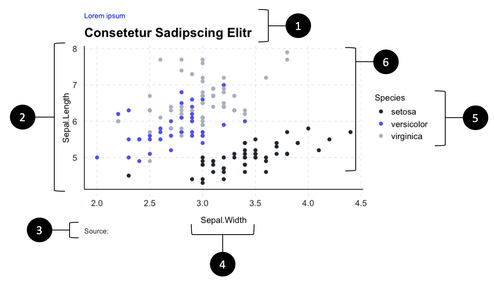

```{r, include = FALSE}
# -------- REPORT TEMPLATE -------- #
# This template provides statworx CI palettes and helpful functions for formatting graphs and tables.
# Follow the sequentially numbered steps.

knitr::opts_chunk$set(echo = TRUE)
htmltools::tagList(rmarkdown::html_dependency_font_awesome())
```

```{r setup, message=FALSE, echo=FALSE}
library(statworxThemes)
library(xml2)
library(knitr)
library(viridis)
library(scales)
library(ggpubr)
library(tidyverse)
library(reshape2)
library(data.table)
library(grid)
library(directlabels)
library(cowplot)
library(gcookbook)
library(gapminder)
library(ggExtra)
devtools::install_github("hrbrmstr/waffle")
library(waffle)
library(treemapify)
library(gghighlight)
library(ggridges)
library(ggforce)
```

# General
The purpose of this template is to enhance the consistency of our graphics across the company. Also, it should save you a bit of time since the structure and appearance of some elements are defined in here. 

# Color palettes

```{r palettes, eval=TRUE, echo=FALSE, message=FALSE, error=FALSE, warning=FALSE}

print("Statworx Highlights")
show_col(statworx_palettes$statworx_highlights, ncol = 5)

print("Statworx standard 1")
show_col(statworx_palettes$statworx_standards_1, ncol = 4)

print("Statworx standard 2")
show_col(statworx_palettes$statworx_standards_2, ncol = 4)


x <- seq(0, 1, length.out = 25)
print("Statworx sequentiell from blue to black")
show_col(seq_gradient_pal(statworx_palettes$continous_blue_black[1],
                          statworx_palettes$continous_blue_black[2])(x))

x <- seq(0, 1, length.out = 25)
print("Statworx sequentiell from blue to white")
show_col(seq_gradient_pal(statworx_palettes$continous_blue_white[1],
                          statworx_palettes$continous_blue_white[2])(x))

x <- seq(0, 1, length.out = 25)
print("Statworx sequentiell from grey to white")
show_col(seq_gradient_pal(statworx_palettes$continous_grey_white[1],
                          statworx_palettes$continous_grey_white[2])(x))


x <- seq(0, 1, length.out = 25)
print("Statworx sequentiell from grey to black")
show_col(seq_gradient_pal(statworx_palettes$continous_grey_black[1], 
                          statworx_palettes$continous_grey_black[2])(x))


x <- seq(0, 1, length.out = 25)
print("Statworx sequentiell from blue to red")
show_col(seq_gradient_pal(statworx_palettes$continous_blue_red[1],
                          statworx_palettes$continous_blue_red[2])(x))

```


# Themes {.tabset .tabset-fade}
The themes proposed in this section will help to ensure a coherent structure of your graphics. The themes are inspired by those of ggplot. Also each themes also offers the possibility to switch to a dark mode.

## Theme classic
```{r, eval=TRUE, echo=FALSE, message=FALSE, error=FALSE, warning=FALSE}

col_list <- c("#0000BF", "#9BAEC1", "#9999FF")

ggplot(iris, aes(Sepal.Width, Sepal.Length, color = Species)) +
  geom_point(size = 2) + labs(title = "Lorem ipsum",
                              subtitle = "Consetetur Sadipscing Elitr") +
  scale_color_statworx(palette = "custom", col_list = col_list) + statworx_classic()

# ggplot(iris, aes(Sepal.Width, Sepal.Length, color = Species)) +
#   geom_point(size = 2) + labs(title = "Lorem ipsum",
#                               subtitle = "Consetetur Sadipscing Elitr") +
#   scale_color_statworx(palette = "custom", col_list = col_list) + 
# statworx_classic(dark = TRUE)

```

## Theme minimal
```{r, eval=TRUE, echo=FALSE, message=FALSE, error=FALSE, warning=FALSE}

col_list <- c("#0000BF", "#9BAEC1", "#9999FF")

ggplot(iris, aes(Sepal.Width, Sepal.Length, color = Species)) +
  geom_point(size = 2) + labs(title = "Lorem ipsum",
                              subtitle = "Consetetur Sadipscing Elitr") +
  scale_color_statworx(palette = "custom", col_list = col_list) + statworx_minimal()

# ggplot(iris, aes(Sepal.Width, Sepal.Length, color = Species)) +
#   geom_point(size = 2) + labs(title = "Lorem ipsum",
#                               subtitle = "Consetetur Sadipscing Elitr") +
#   scale_color_statworx(palette = "custom", col_list = col_list) + statworx_minimal(dark = T)

```

## Theme scientific
```{r, eval=TRUE, echo=FALSE, message=FALSE, error=FALSE, warning=FALSE}


col_list <- c("#0000BF", "#9BAEC1", "#9999FF")

ggplot(iris, aes(Sepal.Width, Sepal.Length, color = Species)) +
  geom_point(size = 2) + labs(title = "Lorem ipsum",
                              subtitle = "Consetetur Sadipscing Elitr") +
  scale_color_statworx(palette = "custom", col_list = col_list) + statworx_scientific()

# 
# ggplot(iris, aes(Sepal.Width, Sepal.Length, color = Species)) +
#   geom_point(size = 2) + labs(title = "Lorem ipsum",
#                               subtitle = "Consetetur Sadipscing Elitr") +
#   scale_color_statworx(palette = "custom", col_list = col_list) + statworx_scientific(dark =T)

```

## Theme hc
```{r, eval=TRUE, echo=FALSE, message=FALSE, error=FALSE, warning=FALSE}

col_list <- c("#0000BF", "#9BAEC1", "#9999FF")

ggplot(iris, aes(Sepal.Width, Sepal.Length, color = Species)) +
  geom_point(size = 2) + labs(title = "Lorem ipsum",
                              subtitle = "Consetetur Sadipscing Elitr") +
  scale_color_statworx(palette = "custom", col_list = col_list) + statworx_hc()

# ggplot(iris, aes(Sepal.Width, Sepal.Length, color = Species)) +
#   geom_point(size = 2) + labs(title = "Lorem ipsum",
#                               subtitle = "Consetetur Sadipscing Elitr") +
#   scale_color_statworx(palette = "custom", col_list = col_list) + statworx_hc(dark = T)
```

## Theme hc2
```{r, eval=TRUE, echo=FALSE, message=FALSE, error=FALSE, warning=FALSE}


col_list <- c("#0000BF", "#9BAEC1", "#9999FF")

ggplot(iris, aes(Sepal.Width, Sepal.Length, color = Species)) +
  geom_point(size = 2) + labs(title = "Lorem ipsum",
                              subtitle = "Consetetur Sadipscing Elitr") +
  scale_color_statworx(palette = "custom", col_list = col_list) + statworx_hc2()

# ggplot(iris, aes(Sepal.Width, Sepal.Length, color = Species)) +
#   geom_point(size = 2) + labs(title = "Lorem ipsum",
#                               subtitle = "Consetetur Sadipscing Elitr") +
#   scale_color_statworx(palette = "custom", col_list = col_list) + statworx_hc2(dark = T)

```

## Theme modern
```{r, eval=TRUE, echo=FALSE, message=FALSE, error=FALSE, warning=FALSE}


col_list <- c("#0000BF", "#9BAEC1", "#9999FF")

ggplot(iris, aes(Sepal.Width, Sepal.Length, color = Species)) +
  geom_point(size = 2) + labs(title = "Lorem ipsum",
                              subtitle = "Consetetur Sadipscing Elitr") +
  scale_color_statworx(palette = "custom", col_list = col_list) + statworx_modern()

# ggplot(iris, aes(Sepal.Width, Sepal.Length, color = Species)) +
#   geom_point(size = 2) + labs(title = "Lorem ipsum",
#                               subtitle = "Consetetur Sadipscing Elitr") +
#   scale_color_statworx(palette = "custom", col_list = col_list) + statworx_modern(dark = T)

```

## Theme flip
```{r, eval=TRUE, echo=FALSE, message=FALSE, error=FALSE, warning=FALSE}


col_list <- c("#0000BF", "#9BAEC1", "#9999FF")

ggplot(iris, aes(Sepal.Width, Sepal.Length, color = Species)) +
  geom_point(size = 2) + labs(title = "Lorem ipsum",
                              subtitle = "Consetetur Sadipscing Elitr") +
  scale_color_statworx(palette = "custom", col_list = col_list) + statworx_flip()
# 
# ggplot(iris, aes(Sepal.Width, Sepal.Length, color = Species)) +
#   geom_point(size = 2) + labs(title = "Lorem ipsum",
#                               subtitle = "Consetetur Sadipscing Elitr") +
#   scale_color_statworx(palette = "custom", col_list = col_list) + statworx_flip(dark = T)

```


## Theme void
```{r, eval=TRUE, echo=FALSE, message=FALSE, error=FALSE, warning=FALSE}

col_list <- c("#0000BF", "#9BAEC1", "#9999FF")

ggplot(iris, aes(Sepal.Width, Sepal.Length, color = Species)) +
  geom_point(size = 2) + labs(title = "Lorem ipsum",
                              subtitle = "Consetetur Sadipscing Elitr") +
  scale_color_statworx(palette = "custom", col_list = col_list) + statworx_void()

# 
# ggplot(iris, aes(Sepal.Width, Sepal.Length, color = Species)) +
#   geom_point(size = 2) + labs(title = "Lorem ipsum",
#                               subtitle = "Consetetur Sadipscing Elitr") +
#   scale_color_statworx(palette = "custom", col_list = col_list) + statworx_void(dark = T)


```
<br>
<br>
<br>

# High-level structure of a plot
In order to achieve a uniform structure of the plots, some components should be included if possible. 
These components are marked in the diagram below.
In some cases it could make sense to deviate from this structure, some examples are displayed in the Gallery below.



<br>
1. Meaningful titles (mirrors the statworx PowerPoint slides) <br>
2. Choose an appropriate scale for the y- and x-axis. <br>
3. If necessary provide a source of the data <br>
4. Label the axis <br>
5. Include a legend <br>
6. Stick to colors defined in the statworx palettes and Design Guide
<br>

